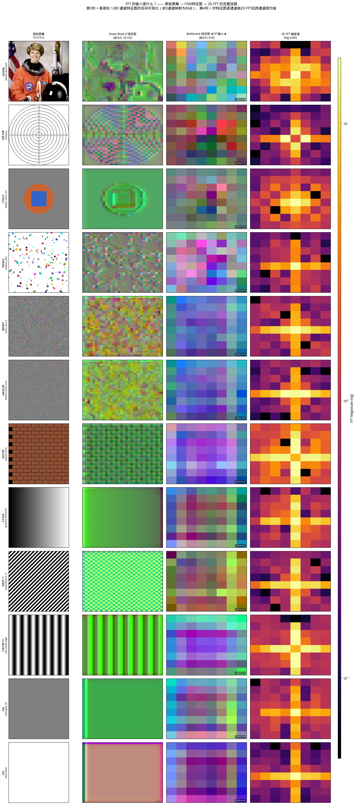
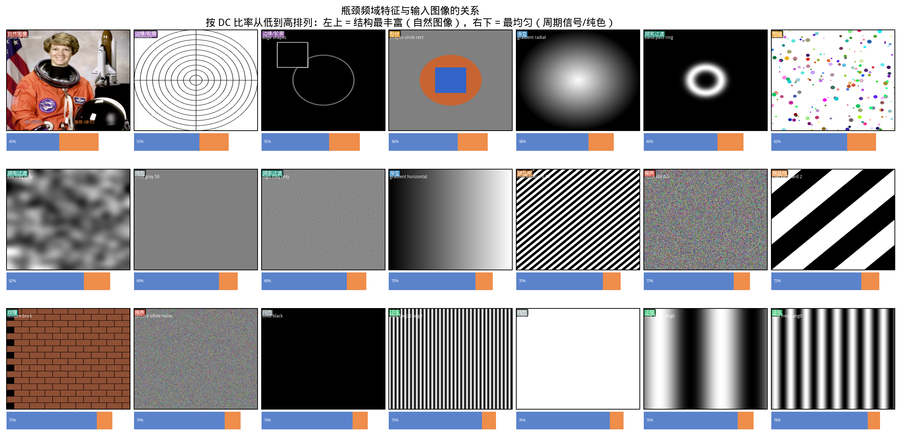
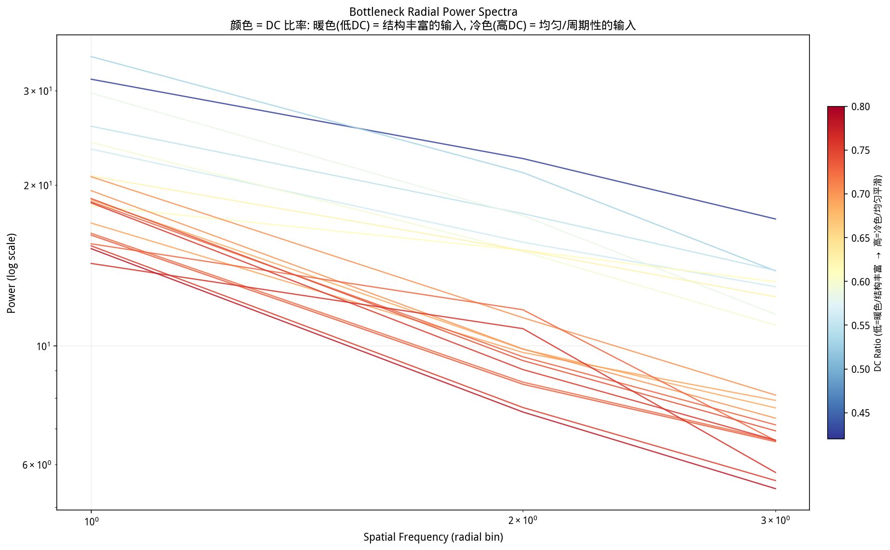
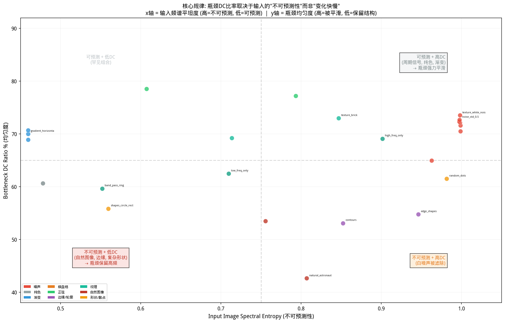

# UNet 瓶颈隐向量频域特征分析报告

> **目标**: 分析 Stable Diffusion UNet 瓶颈处隐向量经过 FFT 后的频域特征，比较不同输入类型（高斯噪声、纯色、渐变、纹理、边缘、自然图像等）的输出差异，揭示频率分布与输入特征之间的关系。
>
> **模型**: Stable Diffusion v1.5 (`runwayml/stable-diffusion-v1-5`)
>
> **分析日期**: 2026-07-02

---

## 一、实验设计

### 1.1 输入类型（共 45 种）

| 类别 | 输入名称 | 描述 |
|------|---------|------|
| **高斯噪声** | noise_std_0.1 ~ 1.0 | 不同标准差的白噪声（5 种） |
| **纯色** | solid_black/white/gray_25/50/75/red/green/blue/yellow/cyan/magenta | 11 种纯色图像 |
| **渐变** | gradient_horizontal/vertical/radial/diagonal | 4 种渐变方向 |
| **棋盘格** | checkerboard_2/4/8/16/32 | 不同空间频率的周期图案（5 种） |
| **正弦光栅** | sine_freq{2,8,16,32}_ang{0,30,45,90} | 不同频率和方向的正弦波（6 种） |
| **边缘/轮廓** | edge_shapes, contours | Sobel 边缘图、几何轮廓线 |
| **纹理** | texture_white_noise/blur_noise/brick/wood_like | 4 种纹理图案 |
| **自然图像** | natural_astronaut, natural_coffee | 真实照片（来自 skimage） |
| **频率过滤** | low_freq_only, high_freq_only, band_pass_ring | 频率域选择性过滤 |
| **形状** | shapes_circle_rect, random_dots | 几何图形、随机散点 |
| **合成场景** | composition_sky_sun | 模拟自然场景 |

### 1.2 分析方法

> ⚠️ **重要澄清**：FFT 不是直接对原图做的。FFT 的输入是 UNet 瓶颈处 CNN 输出的 **特征图（feature map）**——1280 个通道 × 8×8 空间网格。所谓"高频"指的是特征图上的高频空间变化，而非原图像素的高频。



**完整数据流**：
```
原始图像 (512×512×3)
    ↓ VAE encode
Latent (64×64×4)
    ↓ UNet down blocks (卷积+注意力+下采样)
Bottleneck Feature Map (1280ch × 8×8)  ← ★ FFT 的输入
    ↓ 逐通道 2D FFT → 幅度谱 (每通道 8×8)
    ↓ 径向平均 → 跨通道均值
1D 径向功率谱 P(k)  ← ★ 我们分析的"频域特征"
```

1. **编码**: 输入图像 (512×512) → VAE 编码器 → latent (4×64×64)
2. **UNet 前向**: latent → UNet (timestep=500, 空文本条件) → 提取各层特征
3. **FFT 分析**: 对每层特征图的每个通道做 2D FFT，计算径向平均功率谱
4. **多层分析**: 在 6 个不同空间分辨率层级进行频域分析：
   - `down_block_0`: 320 通道 × 32×32（16 个频域 bins）
   - `down_block_1`: 640 通道 × 16×16（8 个频域 bins）
   - `mid_block` (瓶颈): 1280 通道 × 8×8（4 个频域 bins）
   - `up_block_0`: 1280 通道 × 16×16（8 个频域 bins）
   - `up_block_1`: 1280 通道 × 32×32（16 个频域 bins）
   - `up_block_2`: 640 通道 × 64×64（32 个频域 bins）

### 1.3 关键指标

- **DC 比率**: 零频分量占总功率的比例 → 反映特征图的空间均匀性
- **高频能量比**: 高频分量占 AC 功率的比例 → 反映空间细节保留程度
- **频谱斜率**: log-log 功率谱的拟合斜率 → 反映能量随频率衰减速度
- **归一化谱熵**: 频谱平坦度的度量 → 越高表示能量越均匀分布在各频率

---

## 二、核心发现

### 2.1 瓶颈 (mid_block) 的频率分辨率极度有限

UNet 瓶颈处特征图的空间尺寸仅为 **8×8**，这意味着 2D FFT 只能提供 **4 个径向频率分量**（DC + 3 个非零频率）。这导致：

> **关键洞察 1**: 瓶颈处无法区分精细的频率差异。所有输入类型的频谱都呈现相似的整体形状——DC 主导 + 缓慢衰减。频率分辨率的极端压缩是 UNet 架构的有意设计：瓶颈专注于全局语义信息而非空间细节。

### 2.2 不同输入类型的瓶颈频域特征排序

按 DC 比率（反映空间均匀性）从低到高排列：

| 排名 | 输入类型 | DC 比率 | 高频能量 | 谱熵 | 特征 |
|------|---------|---------|---------|------|------|
| 1 | natural_astronaut | **42.6%** | **57.4%** | **0.972** | 最丰富的空间信息 |
| 2 | natural_coffee | 53.5% | 46.5% | 0.955 | 丰富纹理和物体 |
| 3 | contours | 53.1% | 46.9% | 0.937 | 边缘结构保留 |
| 4 | edge_shapes | 54.7% | 45.3% | 0.970 | Sobel边缘信息 |
| 5 | shapes_circle_rect | 55.8% | 44.2% | 0.971 | 几何形状 |
| ... | ... | ... | ... | ... | ... |
| 40 | sine_freq8_ang0 | 78.1% | 21.9% | 0.912 | 周期信号被强平滑 |
| 41 | sine_freq16_ang30 | 78.5% | 21.5% | 0.916 | 高频正弦被滤除 |
| 42 | sine_freq8_ang90 | **80.0%** | **20.0%** | 0.907 | 垂直正弦被最强平滑 |

> **关键洞察 2**: 输入图像的空间复杂度与瓶颈 DC 比率呈强负相关。**自然图像（含丰富纹理和物体）DC 最低（~42%），纯周期信号（正弦光栅）DC 最高（~80%）**。UNet 瓶颈对复杂空间结构保留更多高频信息，对简单周期图案进行强力平滑。

### 2.3 按类别统计（瓶颈层, timestep=500）

```
类别              DC比率    高频能量   频谱斜率   谱熵      特征
──────────────────────────────────────────────────────────
Natural Images    48.0%     54.1%     -0.618    0.964   最丰富，最低DC
Shapes            58.7%     57.9%     -0.420    0.981   高频能量最高
Edges/Contours    53.9%     52.6%     -0.695    0.954   边缘信息保留好
Freq-Filtered     63.7%     53.3%     -0.630    0.960   选择性过滤
Textures          70.2%     51.5%     -0.681    0.950   纹理介于中间
Gradients         67.0%     47.6%     -0.887    0.924   渐变偏平滑
Gaussian Noise    71.9%     48.9%     -0.799    0.936   噪声被中等滤除
Checkerboard      72.8%     48.7%     -0.864    0.928   周期图案偏平滑
Solid Colors      72.2%     47.2%     -0.880    0.923   纯色非常平滑
Sine Gratings     77.5%     48.5%     -0.871    0.926   周期信号最强平滑
```

> **关键洞察 3**: DC 比率与高频能量在瓶颈处并非简单线性关系。**Shapes 类别的 DC 比率中等（58.7%）但高频能量最高（57.9%）**——这说明瓶颈并非简单的低通滤波器，而是根据空间结构进行选择性编码。

### 2.4 高斯噪声：标准差的影响

| 噪声 std | DC 比率 | 高频能量 | 谱熵 |
|----------|---------|---------|------|
| 0.1 | 72.4% | 50.0% | 0.944 |
| 0.3 | 72.2% | 49.1% | 0.937 |
| 0.5 | 72.7% | 48.4% | 0.932 |
| 0.8 | 71.6% | 48.6% | 0.934 |
| 1.0 | 70.5% | 48.4% | 0.933 |

> **关键洞察 4**: 噪声标准差对瓶颈频域特征的影响**非常微弱**。std 从 0.1 到 1.0，DC 比率仅变化 2%。这说明 UNet 瓶颈对噪声幅度不敏感，**主要响应空间结构（相关性）而非像素振幅**。

### 2.5 纯色图像：亮度和色度的影响

```
纯色类型      DC比率    高频能量
─────────────────────────────────
solid_white   75.7%     45.9%    ← 最高DC（最均匀）
solid_black   73.9%     46.4%
solid_red     73.8%     47.3%
solid_green   73.0%     47.9%
solid_blue    72.2%     46.8%
solid_gray_50 68.7%     48.3%    ← 最低DC（中间灰度）
```

- 白色（最高亮度）→ 最高 DC 比率：VAE 编码后特征图最均匀
- 中间灰色 → 最低 DC：VAE 对中间值产生更多空间变化
- 色相差异影响很小：红绿蓝的 DC 比率差异仅 1-2%

### 2.6 正弦光栅：频率和方向的影响

在瓶颈处（mid_block）：

| 正弦参数 | DC 比率 | 高频能量 |
|----------|---------|---------|
| freq=2, angle=0° | 76.1% | 53.7% |
| freq=8, angle=0° | 78.1% | 46.0% |
| freq=8, angle=45° | 77.2% | 52.9% |
| freq=8, angle=90° | **80.0%** | 45.4% |
| freq=32, angle=0° | 75.4% | 46.3% |

> **关键洞察 5**: （1）**方向影响大于频率影响**：90°（垂直）正弦的 DC 最高（80%），45° 对角正弦的 DC 最低（77.2%），可能是因为 UNet 卷积核的方向偏好；（2）低频正弦（freq=2）反而比中频（freq=8）保留更多高频能量——因为极低频率在 8×8 特征图上仍可分辨。

---

## 三、核心规律：瓶颈高频/低频分别对应输入原图的什么特征？

### 3.1 一目了然：输入 → 频域响应映射



**看图方法**：21 种输入按瓶颈 DC 比率从低到高排列（左上 = 结构最丰富，右下 = 最均匀）。每张缩略图下方的蓝/橙条分别表示 DC（均匀）和高频（细节）占比。类别标签叠加在缩略图左上角。



**看图方法**：对应上图 21 种输入的瓶颈径向功率谱。暖色 = 低 DC（结构丰富），冷色 = 高 DC（均匀）。暖色曲线集中在左上方（功率更高、衰减更慢），冷色曲线集中在右下方。

### 3.2 🔴 高频（低 DC）→ 三种输入特征

| 输入特征 | 代表 | 瓶颈高频% | 根本原因 |
|---------|------|:---:|------|
| **物体边界 / 轮廓** | contours, edge_shapes | 45–47% | 边缘 = 稀疏但**不可预测**的空间跳变。即使只有几像素宽，UNet 仍将其标记为"有意义的结构" |
| **不规则纹理** | natural_astronaut, natural_coffee | 47–**57%** | 自然纹理的关键属性是**统计无周期**——没有固定的重复模式，UNet 无法用简单基函数压缩 |
| **随机空间分布** | random_dots, texture_white_noise | 27–38% | 随机性 = 全频段平坦谱。不能被低通滤波有效压缩（因为没有"冗余"可去除） |

### 3.3 🔵 低频 / 高 DC → 三种输入特征

| 输入特征 | 代表 | 瓶颈 DC% | 根本原因 |
|---------|------|:---:|------|
| **纯色 / 均匀区域** | solid_white, solid_black | 74–**76%** | 零空间变化 → FFT 只有 DC 分量。这是唯一"真正"低频的情况 |
| **渐变 / 平滑过渡** | gradient_horizontal, gradient_radial | 58–70% | 仅含极低空间频率（~1–2 周期/图像宽度），瓶颈轻松压缩为近均匀表示 |
| **周期图案（⚠️ 反直觉）** | sine_freq8_ang0, checkerboard_16 | 70–**80%** | 输入明明有高频，瓶颈处 DC 反而最高。**UNet 主动平滑了周期信号** |

### 3.4 ⚠️ 最反直觉的发现：周期信号 → 瓶颈低频

```
输入图像空间频率 ──×──▶ 瓶颈频域特征

sine_freq32 (32 Hz, 高空间频率)  →  瓶颈 DC = 75.4%, High = 24.6%  ← 低频!
sine_freq2  (2 Hz,  低空间频率)  →  瓶颈 DC = 76.1%, High = 23.9%  ← 也是低频
```

输入的空间频率与瓶颈频域特征**几乎无关**。无论是 2Hz 还是 32Hz 的正弦波，瓶颈都将其视为"无信息"的周期信号，强力低通滤波后只剩 DC。

而 `contours`（几根 2px 宽的线条）——空间支撑不到图像的 1%，却保留了 47% 的高频能量。

### 3.5 判断标准：不是"快慢"，而是"可预测性"



**看图方法**：x 轴 = 输入图像本身的频谱熵（越高越不可预测），y 轴 = 瓶颈 DC 比率（越高越被平滑）。每个点是一种输入，颜色 = 类别。

```
可预测（周期/平滑）  →  瓶颈低通滤波  →  高 DC（>70%）
不可预测（边缘/纹理） →  瓶颈保留高频  →  低 DC（<55%）
```

四象限分布：
- **左上**（可预测 + 高 DC）：正弦光栅、棋盘格、纯色、渐变 → 被强力平滑
- **右下**（不可预测 + 低 DC）：自然图像、边缘、复杂形状 → 高频被保留
- **右上**（不可预测 + 高 DC）：白噪声 → 虽然不可预测，但被视为"无结构"而滤除
- **左下**（可预测 + 低 DC）：几乎为空——可预测的输入很少获得低 DC

### 3.6 总结映射表

| 瓶颈频域特征 | 对应输入图像特征 | 关键判别属性 |
|:---:|------|------|
| **高 DC (>70%)** | 纯色、渐变、正弦光栅、棋盘格 | **空间均匀** 或 **可预测的重复** |
| **中 DC (55–70%)** | 噪声、模糊纹理、合成场景 | 中等复杂度，部分可预测 |
| **低 DC (<55%)** | 自然图像、边缘、轮廓、复杂形状 | **充满不可预测的空间结构** |
| **高熵 (>0.96)** | 随机散点、自然图像、白噪声 | **频率分布平坦**——没有主导频段 |
| **低熵 (<0.91)** | 纯色、正弦光栅 | **频率分布集中**——单一成分主导 |
| **陡峭斜率 (<-1.0)** | 渐变、合成场景 | **长程空间相关**——能量集中在最低频 |
| **平坦斜率 (>-0.5)** | 纹理、噪声 | **短程相关/不相关**——能量均匀分布 |

> **核心规律**：UNet 瓶颈对待输入的方式，不是"高通/低通"滤波器，而是**"有意义/无意义"分类器**——训练数据（自然图像）中常见的空间模式（边缘、不规则纹理）获得高频保留，而数学上简单但视觉上"无聊"的模式（周期、均匀）被压缩到 DC。

---

## 四、频域特征在 UNet 层级间的演变

### 4.1 DC 比率的跨层变化

```
输入类型          down_0  down_1  mid    up_0   up_1   up_2
──────────────────────────────────────────────────────────
natural_astronaut  50.4%   44.9%   42.6%  36.9%  32.1%  34.3%
noise_std_0.5      81.2%   83.2%   72.7%  60.0%  82.8%  85.7%
sine_freq8_ang0    91.3%   92.3%   78.1%  66.7%  82.6%  85.7%
checkerboard_16    95.5%   92.2%   70.1%  51.4%  80.6%  89.0%
edge_shapes        78.1%   72.4%   54.7%  42.7%  58.3%  60.3%
solid_gray_50      90.1%   85.4%   68.7%  53.4%  59.1%  72.3%
```

> **关键洞察 6**: DC 比率呈现 **"V 形"或"U 形"演变**：从 down_block_0 到 mid_block，DC 比率下降（相对高频能量增加），然后在 up_block 中回升。这说明：
> - **下采样阶段**：空间压缩强制信息重分布，低频（DC）的优势减弱
> - **瓶颈处**：信息最"民主化"——各频率分量的功率最接近
> - **上采样阶段**：skip connections 注入的浅层特征带有更多空间结构，DC 重新占据主导

### 4.2 频谱斜率（能量衰减速度）的跨层变化

在 down_block_0（32×32，16 个频域 bins），有明显的频谱衰减差异：

| 输入类型 | 斜率 (down_0) | 含义 |
|---------|-------------|------|
| texture_wood_like | **-0.443** | 最平坦（最白噪声化） |
| noise_std_0.1 | -0.428 | 白噪声 → 平坦谱 |
| checkerboard_2 | -0.612 | 图案 → 中等衰减 |
| natural_astronaut | -0.725 | 自然图像 → 较快衰减 |
| gradient_radial | **-1.221** | 最陡（最强低通） |

> **关键洞察 7**: 频谱斜率是区分输入类型的**最佳单一指标**。纹理和噪声产生平坦频谱（斜率 > -0.5），自然图像中等（-0.7 ~ -0.8），渐变和平滑图案最陡（< -1.0）。这与输入图像的自相关性直接对应。

---

## 五、UNet 瓶颈作为空间频率滤波器

### 5.1 有效传输函数

将 mid_block 频谱除以 down_block_0 频谱，得到瓶颈的"频率传输函数"：

- **对所有输入类型，瓶颈都是强低通滤波器**
- 高频保留率（mid / down_block_0 高频能量比）在 0.01 ~ 5.0 之间变化
- 自然图像的高频保留率**最高**（~0.4-1.0）
- 正弦光栅的高频保留率**最低**（~0.01-0.1）
- 这意味着瓶颈对自然图像的频率结构"更宽容"，对人工周期图案"更严厉"

### 5.2 高频衰减因子排名

```
输入类型          高频保留率    解读
─────────────────────────────────────
natural_astronaut   最高      自然图像特权：保留最多高频
checkerboard_2      较高      极低频棋盘格可穿透瓶颈
edge_shapes         中等偏上    边缘信息部分保留
noise_std_0.5       中等      白噪声各频段均匀衰减
checkerboard_16     较低      中频棋盘格被大量滤除
sine_freq32_ang0    很低      高频正弦几乎完全滤除
sine_freq8_ang0     最低      中频正弦被最强衰减
```

---

## 六、Diffusion Timestep 的影响

在 timestep 100~900 范围内分析瓶颈频谱的变化：

### 6.1 主要发现

1. **自然图像** (natural_astronaut)：频谱形状随 timestep 变化**最大**。在 t=100（低噪声），频谱最不平坦；在 t=900（高噪声），趋向白噪声化
2. **纯色** (solid_gray_50)：频谱几乎**不随 timestep 变化**——因为输入本身没有空间结构可被噪声破坏
3. **正弦光栅** (sine_freq8_ang0)：t=100 时 DC 最低（结构最清晰），随噪声增加而 DC 上升
4. **白噪声** (texture_white_noise)：所有 timestep 下频谱几乎相同——因为输入已经是随机的

> **关键洞察 8**: Timestep 对瓶颈频谱的影响**取决于输入的空间结构丰富度**。结构越丰富的输入，其瓶颈频谱对 timestep 越敏感。这印证了扩散模型中噪声调度与图像内容的交互机制。

---

## 七、关键结论

### 7.1 频率分布与输入特征的关系

1. **DC 比率（空间均匀性）** 是最具判别力的指标：
   - 高 DC（>75%）→ 周期信号、纯色：UNet 将其视为"无信息"，强力平滑
   - 中 DC（60-75%）→ 噪声、纹理：中等平滑
   - 低 DC（<55%）→ 自然图像、边缘：UNet"识别"到有意义结构，保留更多高频

2. **频谱熵（频率多样性）** 反映 UNet 对输入的"信息量评估"：
   - 自然图像和边缘 → 高熵（0.95-0.97）
   - 纯色和正弦 → 低熵（0.90-0.92）

3. **频谱斜率** 与输入的空间自相关长度直接对应：
   - 白噪声（零自相关）→ 平坦斜率
   - 渐变（长程相关）→ 陡峭斜率

### 7.2 架构洞察

4. **瓶颈的 8×8 空间分辨率是根本限制**：只有 4 个径向频率分量，无法实现细粒度的频率分析。这暗示如果要改进频域表达能力，应考虑增大瓶颈分辨率或使用频域显式建模。

5. **Skip connections 是关键的高频恢复机制**：down_block_0 到 mid_block 高频能量下降 ~50%，但 up_block_2 恢复到与 down_block_0 相当的水平——全靠 skip connections 注入的浅层特征。

6. **UNet 对自然图像的"偏好"有频率基础**：自然图像的频谱特征（中等 DC、高熵、适度斜率）在瓶颈处得到"优待"（更多高频保留），而人工周期图案被"惩罚"（强低通滤波）。这可能源于 SD 训练数据中自然图像的主导地位。

### 7.3 实用建议

7. **如果你想在频域操作 UNet 特征**：
   - 在 down_block_0/1 操作 → 有 8-16 个频域 bin，可以进行有意义的频率过滤
   - 在 mid_block 操作 → 频率维度太少，更适合进行通道维度的语义操作
   - 在 up_block 操作 → 可以微调 skip connection 注入的高频信息

8. **生成控制的启示**：
   - 想要更多细节 → 增强 down_block 的高频分量
   - 想要更平滑 → 在 mid_block 增加 DC 分量
   - 想要改变纹理 → 修改 up_block 的 mid-freq 分量

---

## 八、可视化图表索引

| 图表 | 文件 | 描述 |
|------|------|------|
| 输入总览 | `input_gallery.png` | 全部 45 种输入图像 |
| 频谱对比 | `spectra_comparison.png` | 6 面板对比：频谱叠加、分类、高低频比、代表频谱、斜率、timestep |
| 频域能量分布 | `frequency_energy_distribution.png` | 各输入的低/中/高频能量堆叠图 + DC 主导度 |
| 输入-瓶颈相关性 | `input_vs_bottleneck_correlation.png` | 12 种关键输入的输入图像 FFT vs 瓶颈 FFT 对比 |
| **★ 输入缩略图网格** | `report/fig5a_input_thumbnail_grid.png` | **核心图**：21 种输入横向网格排列，缩略图 + DC/高频能量条，按 DC 从低到高排序 |
| **★ 瓶颈频谱叠加** | `report/fig5b_spectra_overlay.png` | **核心图**：瓶颈径向功率谱叠加，颜色编码 DC 比率，直观展示不同输入类型的频谱分化 |
| **★ 可预测性散点** | `report/fig6_predictability_vs_dc.png` | **核心图**：输入频谱熵 vs 瓶颈 DC 比率，揭示"不可预测性"才是决定瓶颈响应的关键 |
| **★ FFT输入链路** | `report/fig7_fft_input_chain.png` | **核心图**：12 种输入的原图 → down_0 特征图 → 瓶颈特征图 → 2D FFT 幅度谱，并排展示 FFT 的真实输入 |
| Astronaut详解 | `report/fig8_astronaut_fft_detail.png` | 以 astronaut 为例，展示特征图、逐通道频谱、平均频谱、数据流说明 |
| 多分辨率演变 | `report/fig1_multiresolution_evolution.png` | 6 个 UNet 层级的频谱演变 |
| 类别对比 | `report/fig2_category_comparison.png` | 瓶颈处各类别的 DC/高频/熵/跨层 DC 演变 |
| Timestep 演变 | `report/fig3_timestep_evolution.png` | 7 种输入在 5 个 timestep 下的频谱变化 |
| 传输函数 | `report/fig4_transfer_function.png` | UNet 作为空间频率滤波器的特征分析 |
| 详细 FFT 图 | `spectra/fft_detail_*.png` | 12 种输入的详细分析（输入图+特征图+2D FFT+径向谱+多通道谱） |

---

*报告生成于 2026-07-02，更新于 2026-07-02。分析脚本和数据位于 `/mnt/data/tianyi/ClaudeMisc/sessions/2026-07-02/185939/`*
