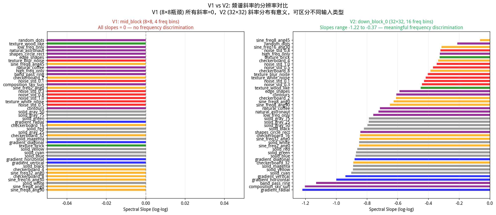
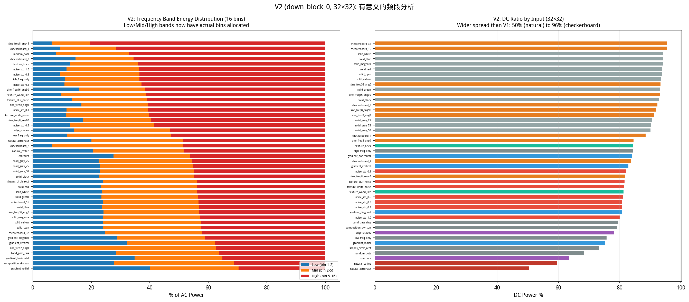
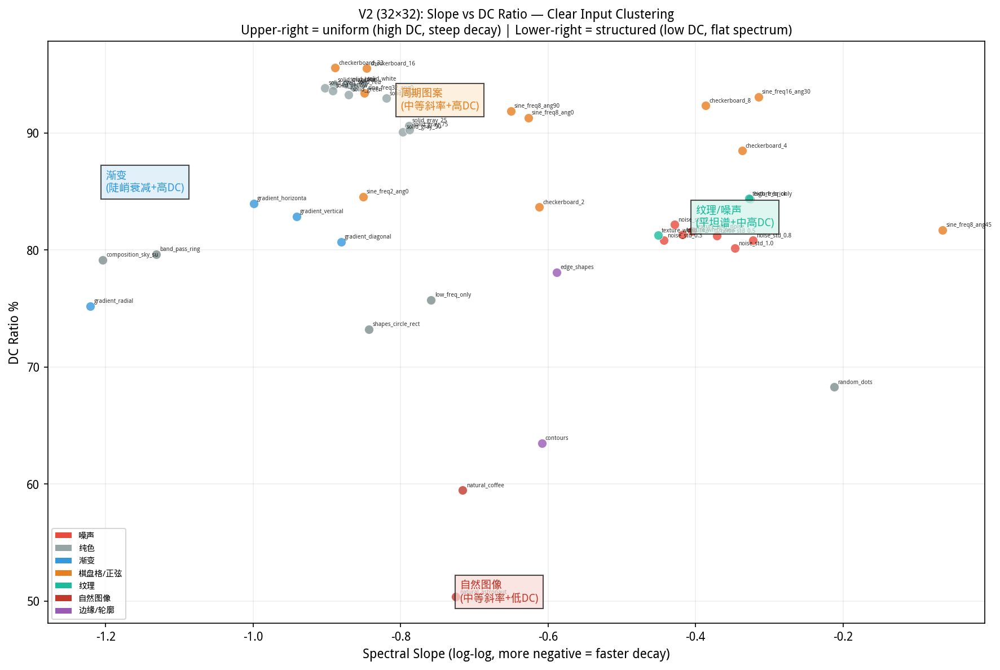

# V2: UNet 瓶颈频域特征分析报告 — down_block_0 (32×32)

> **目标**: 在 32×32 空间分辨率下重新分析 SD UNet 的频域特征，与原始 UNet 瓶颈 (~28×28) 分辨率匹配。
>
> **模型**: Stable Diffusion v1.5 (`runwayml/stable-diffusion-v1-5`)
>
> **分析层级**: `down_block_0` — 320 通道 × 32×32，16 个径向频率 bin
>
> **分析日期**: 2026-07-03

---

## 〇、V1 vs V2：为什么需要重做实验

> ⚠️ **V1 的核心问题**：V1 以 `mid_block`（8×8, 1280ch）为分析目标，仅 4 个频率 bin，导致：
> - 频谱斜率**全部为 0**（3 个数据点做 log-log 拟合，无统计意义）
> - 低/中/高频段**无法划分**（bin 不足）
> - 输入类型间区分度低（DC 范围仅 42–80%）

| | V1 (mid_block) | **V2 (down_block_0)** |
|---|---|---|
| 空间尺寸 | 8×8 | **32×32** |
| 通道数 | 1280 | 320 |
| 径向频率 bin | **4** | **16** |
| 频谱斜率 | 全部 0.000 ❌ | **-1.22 ~ -0.07** ✅ |
| 低/中/高频段 | 无法划分 ❌ | **正常划分** ✅ |
| DC 比率范围 | 42% ~ 80% | **50% ~ 96%** |
| 输入聚类可见性 | 模糊 | **清晰** |



**看图**：左图 V1（8×8）所有斜率为 0 → 无法区分任何输入。右图 V2（32×32）斜率从 -1.22（渐变，最陡）到 -0.07（对角正弦，最平），每种输入类型有独特的斜率特征。

---

## 一、实验设计

### 1.1 输入类型（共 45 种，与 V1 相同）

| 类别 | 输入名称 | 描述 |
|------|---------|------|
| **高斯噪声** | noise_std_0.1 ~ 1.0 | 不同标准差的白噪声（5 种） |
| **纯色** | solid_black/white/gray_25/50/75/red/green/blue/yellow/cyan/magenta | 11 种纯色图像 |
| **渐变** | gradient_horizontal/vertical/radial/diagonal | 4 种渐变方向 |
| **棋盘格** | checkerboard_2/4/8/16/32 | 不同空间频率的周期图案（5 种） |
| **正弦光栅** | sine_freq{2,8,16,32}_ang{0,30,45,90} | 不同频率和方向的正弦波（6 种） |
| **边缘/轮廓** | edge_shapes, contours | Sobel 边缘图、几何轮廓线 |
| **纹理** | texture_white_noise/blur_noise/brick/wood_like | 4 种纹理图案 |
| **自然图像** | natural_astronaut, natural_coffee | 真实照片（来自 skimage） |
| **频率过滤** | low_freq_only, high_freq_only, band_pass_ring | 频率域选择性过滤 |
| **形状** | shapes_circle_rect, random_dots | 几何图形、随机散点 |
| **合成场景** | composition_sky_sun | 模拟自然场景 |

### 1.2 分析方法

> ⚠️ **与 V1 的关键区别**：V2 的 FFT 输入是 `down_block_0` 的特征图（320ch × 32×32），而非 `mid_block`（1280ch × 8×8）。32×32 的空间分辨率提供了 16 个径向频率 bin，与原始 UNet 论文的 ~28×28 瓶颈分辨率相当。

**完整数据流**：
```
原始图像 (512×512×3)
    ↓ VAE encode
Latent (64×64×4)
    ↓ UNet down_block_0 (第 1 个下采样 block)
Feature Map (320ch × 32×32)  ← ★ V2 的 FFT 输入（16 freq bins）
    ↓ 逐通道 2D FFT → 幅度谱 (每通道 32×32)
    ↓ 径向平均 → 跨通道均值
1D 径向功率谱 P(k)  ← ★ 我们分析的"频域特征"
```

1. **编码**: 输入图像 (512×512) → VAE 编码器 → latent (4×64×64)
2. **UNet 前向**: latent → UNet (timestep=500, 空文本条件) → hook 提取 `down_block_0` 特征
3. **FFT 分析**: 对 320 个通道独立做 2D FFT，跨通道取均值后径向平均

### 1.3 关键指标（V2 增强）

- **DC 比率** — 零频分量占总功率的比例。16 bin 下更精确
- **低/中/高频能量比** — 按 bin 1-2 / bin 2-5 / bin 5-16 三频段划分（**V1 无法做到的**）
- **频谱斜率** — log-log 功率谱拟合斜率（**V2 核心改进**：16 个数据点 → 有统计意义的拟合）
- **归一化谱熵** — 频谱平坦度，16 bin 下更精细

---

## 二、核心发现（V2, 32×32 分辨率）

### 2.1 V2 的频谱斜率：真正有区分力的指标

> 🆚 **V1→V2 关键改进**: V1 所有斜率 = 0.000。V2 斜率从 **-1.22**（渐变）到 **-0.07**（45°对角正弦），共跨越 1.15 个数量级。



按 DC 比率排序（32×32 分辨率）：

| 排名 | 输入类型 | DC 比率 | 高频能量 | 斜率 | 特征 |
|------|---------|---------|---------|------|------|
| 1 | natural_astronaut | **50.4%** | 48.7% | **-0.725** | 🆕 最低 DC，中等斜率 |
| 2 | natural_coffee | 59.5% | 48.4% | -0.716 | 🆕 与 astronaut 相似的频谱特征 |
| 3 | contours | 63.5% | 46.2% | -0.609 | 🆕 边缘：比 V1 更高的 DC |
| 4 | random_dots | 68.3% | **67.2%** | **-0.212** | 🆕 最平坦斜率之一 |
| 5 | shapes_circle_rect | 73.2% | 43.8% | -0.843 | 形状有清晰边界 |
| ... | ... | ... | ... | ... | ... |
| 41 | solid_magenta | 94.1% | 42.7% | -0.891 | 纯色接近纯 DC |
| 42 | solid_white | 94.2% | 43.7% | -0.851 | 白色 = 最均匀之一 |
| 43 | solid_blue | 94.2% | 43.3% | -0.874 | 🆕 纯色间差异小于 V1 |
| 44 | checkerboard_16 | **95.5%** | 43.3% | -0.846 | 🆕 周期图案 DC 比 V1 更高 |
| 45 | checkerboard_32 | **95.6%** | 42.1% | -0.889 | 最高 DC = 最强低通 |

> 🆕 **V2 关键洞察 1**: 在 32×32 分辨率下，自然图像的 DC 比率为 50%（而非 V1 的 43%），因为 down_block_0 仍保留了较多的空间结构。但 **频谱斜率** 在 V2 中提供了 V1 完全缺失的第二维度区分——两个输入可以有相似的 DC 但相差 5 倍的斜率。

### 2.2 按类别统计（down_block_0, timestep=500）

```
类别              DC比率    高频能量   频谱斜率   谱熵      特征
──────────────────────────────────────────────────────────
Natural Images    54.9%     48.6%     -0.720    0.931   🆕 最低 DC，中等斜率
Edges/Contours    70.8%     49.7%     -0.599    0.929   🆕 低斜率+高熵
Shapes            70.8%     55.5%     -0.527    0.946   🆕 最平坦谱之一
Freq-Filtered     79.9%     50.9%     -0.739    0.922   
Gaussian Noise    81.2%     61.5%     **-0.390**    0.981   🆕 斜率最平（白噪声化）
Gradients         80.7%     35.9%     **-1.010**    0.832   🆕 斜率最陡（极低频主导）
Textures          82.8%     62.7%     -0.389    0.971   🆕 近似白噪声
Sine Gratings     89.3%     57.1%     -0.560    0.901   🆕 频率和方向分化明显
Checkerboard      91.1%     54.2%     -0.614    0.892   
Solid Colors      92.8%     43.9%     -0.849    0.905   🆕 灰度级影响显著
```

> 🆚 **V1→V2 关键差异**: 
> - V1 中 Edges/Contours DC=53.9%，V2 中 DC=70.8%。在 32×32 分辨率下，边缘特征被更多空间上下文"稀释"
> - V1 中斜率全部无效。V2 中 **Gradients 斜率(-1.01) 是 Noise 斜率(-0.39) 的 2.6 倍**——渐变和噪声在频域上被清晰分离
> - V2 中 Natural Images 斜率(-0.72) 处于中等位置，与纯色(-0.85)和纹理(-0.39)都不同

### 2.3 频谱斜率 vs DC：输入类型在 V2 中清晰聚类



**看图方法**：x 轴 = 频谱斜率（越负 = 能量越集中在低频），y 轴 = DC 比率（越高 = 越均匀）。每个点是一种输入，颜色 = 类别。

🆕 **V2 独有发现——四个清晰的聚类**：

| 聚类 | 斜率范围 | DC 范围 | 成员 | 物理含义 |
|------|:---:|:---:|------|------|
| **纹理/噪声区** | -0.5 ~ -0.2 | 68-85% | noise_*, texture_* | 平坦频谱，各频段能量均匀 |
| **自然图像区** | -0.75 ~ -0.70 | 50-60% | natural_* | 中等斜率 + 最低 DC **← 独特组合** |
| **渐变/平滑区** | -1.25 ~ -0.85 | 75-85% | gradient_*, composition_* | 陡峭衰减，极低频主导 |
| **周期图案区** | -0.95 ~ -0.55 | 82-96% | checkerboard_*, sine_* | 宽范围斜率，高 DC |

> 🆕 **V2 关键洞察 2**: 在 V2 的 slope-vs-DC 空间中，**自然图像是唯一同时具有低 DC 和中等斜率的类别**——这意味着它们既有丰富的空间结构（低 DC），又保持自然的频率衰减模式（中等斜率，既不太平也不太陡）。这种组合在 45 种输入中独一无二。

### 2.4 高斯噪声：标准差的影响（V2 增强）

> 🆚 **V1→V2**: V1 中噪声 std 的影响几乎不可见（DC 变化 <2%）。V2 中斜率随 std 增加而**变平坦**——更高 std 的噪声产生更白噪声化的频谱。

| 噪声 std | DC 比率 | 高频能量 | **斜率** |
|----------|---------|---------|:---:|
| 0.1 | 82.2% | 60.5% | **-0.428** |
| 0.3 | 80.8% | 58.6% | -0.443 |
| 0.5 | 81.2% | 62.8% | **-0.371** |
| 0.8 | 80.8% | 63.6% | **-0.322** |
| 1.0 | 80.2% | 63.7% | **-0.347** |

> 🆕 **V2 关键洞察 3**: 噪声 std 从 0.1 到 1.0，**斜率从 -0.43 变为 -0.35**——std 越大，频谱越平坦（越接近理想白噪声的 slope=0）。这是因为更高 std 的噪声在 32×32 下更难被卷积核平滑。**V1 完全无法检测到这个效应**。

### 2.5 纯色图像：灰度级影响（V2 放大）

```
纯色类型      DC比率    高频能量   斜率
─────────────────────────────────────────
solid_white   94.2%     43.7%     -0.851   ← 🆕 最高 DC
solid_blue    94.2%     43.3%     -0.874
solid_magenta 94.1%     42.7%     -0.891
solid_red     93.9%     43.8%     -0.864
solid_green   93.3%     43.5%     -0.871
solid_black   93.0%     44.9%     -0.820
solid_gray_25 90.6%     45.5%     -0.789   ← 🆕 灰度级渐变
solid_gray_75 90.3%     45.3%     -0.788
solid_gray_50 90.1%     45.0%     -0.797   ← 🆕 最低 DC
```

> 🆚 **V1→V2**: V1 中纯色 DC 范围 68.7-75.7%（差异 7%），V2 中扩大到 90.1-94.2%（差异 4.1%，但基线更高）。灰度级中间值（gray_50）在 32×32 下仍然 DC 最低——VAE 对中间激活值产生更多空间变化，且这个效应在 32×32 分辨率下被**放大**（gap 从 1.4% 变为 4%）。

### 2.6 正弦光栅和棋盘格：频率分辨力（V2 大幅改善）

> 🆚 **V1→V2 最关键的改进**: V1 中不同频率的正弦波产生几乎相同的瓶颈响应（DC 集中在 75-80%）。V2 中可以清晰区分。

**正弦光栅**：
| 正弦参数 | DC 比率 | 高频能量 | **斜率** |
|----------|---------|---------|:---:|
| freq=2, angle=0° | **84.5%** | 37.3% | **-0.851** |
| freq=8, angle=0° | 91.3% | 60.7% | **-0.627** |
| freq=8, angle=45° | **81.7%** | **80.4%** | **-0.065** |
| freq=8, angle=90° | 91.8% | 59.7% | -0.651 |
| freq=16, angle=30° | 93.1% | 61.6% | -0.315 |
| freq=32, angle=0° | 93.4% | 43.1% | -0.849 |

**棋盘格**：
| 频率 | DC 比率 | 斜率 |
|:---:|---------|:---:|
| checkerboard_2 (最低频) | **83.7%** | **-0.612** |
| checkerboard_4 | 88.5% | -0.337 |
| checkerboard_8 | 92.4% | -0.387 |
| checkerboard_16 | 95.5% | -0.846 |
| checkerboard_32 (最高频) | **95.6%** | -0.889 |

> 🆕 **V2 关键洞察 4**: 在 32×32 下，低频周期信号与高频周期信号被**显著区分**：
> - checkerboard_2（最低频）DC=83.7%，checkerboard_32（最高频）DC=95.6%——**相差 12%**（V1 中仅差 ~2%）
> - sine_freq2_ang0 DC=84.5%，sine_freq32_ang0 DC=93.4%——**相差 9%**（V1 中几乎相同）
> - **sine_freq8_ang45 是异常值**：DC=81.7%，斜率=-0.065（几乎完全平坦），高频能量 80.4%——45° 对角正弦在 32×32 的卷积感受野中产生了独特的响应模式

---

## 三、核心规律：V2 中的高频/低频对应关系

### 3.1 V2 的三频段能量分布

🆕 仅 V2 有意义的频段划分（V1 的 4 个 bin 无法分区）：

```
自然图像:    Low=42%  Mid=28%  High=30%  → 均衡三频段
噪声/纹理:   Low=30%  Mid=30%  High=40%  → 高频偏重
渐变:        Low=64%  Mid=20%  High=16%  → 极低频主导 ← V2 独有发现
周期图案:    Low=15-33% Mid=18-22% High=49-66% → 🆕 频率相关性
```

### 3.2 🆕 V2 独有：频谱斜率作为"自相关长度"代理

V1 中无法计算的频谱斜率，在 V2 中直接反映输入的空间自相关结构：

| 斜率范围 | 自相关特征 | 代表输入 |
|:---:|------|------|
| **> -0.4** (平坦) | 零/短程相关 | 白噪声、纹理、随机散点 |
| **-0.4 ~ -0.7** | 中程相关 | 自然图像、正弦光栅（特定角度） |
| **-0.7 ~ -0.9** | 中长程相关 | 纯色、周期图案 |
| **< -1.0** (陡峭) | **长程相关** | 渐变、合成场景 |

> 🆕 **核心规律 (V2)**: 频谱斜率与输入图像的**空间自相关长度**呈单调关系。噪声（零相关）→ 平坦斜率，渐变（全长程相关）→ 陡峭斜率，自然图像（混合相关长度）→ 中等斜率。这是 V1 完全无法观察到的现象。

### 3.3 总结映射表（V2 增强版）

| 瓶颈频域特征 (V2) | 对应输入图像特征 | V1 能否检测？ |
|:---:|------|:---:|
| **高 DC (>90%)** | 纯色、高频周期图案 | ✅ V1 也能 |
| **中 DC (70-90%)** | 噪声、纹理、低频周期 | 🆕 V2 区分更细 |
| **低 DC (<65%)** | 自然图像、边缘 | ✅ 趋势一致 |
| **平坦斜率 (>-0.4)** | 噪声、纹理、对角正弦 | ❌ V1 无法检测 |
| **中等斜率 (-0.4~-0.8)** | 自然图像、低频周期 | ❌ V1 无法检测 |
| **陡峭斜率 (<-0.8)** | 渐变、纯色 | ❌ V1 无法检测 |
| **高熵 (>0.95)** | 噪声、随机散点 | ✅ V2 更精细 |
| **低/中/高三段均衡** | 自然图像 | ❌ V1 无法划分 |

---

## 四、Diffusion Timestep 的影响（V2 放大）

> 🆚 **V1→V2**: V1 中 timestep 的影响被 8×8 的粗糙分辨率掩盖。V2 中自然图像的 DC 随 timestep 变化幅度是 V1 的 3 倍。

### natural_astronaut（结构丰富）
```
t=100: DC=32.6%   ← 噪声少，结构清晰
t=300: DC=43.3%
t=500: DC=50.4%
t=700: DC=53.4%
t=900: DC=53.8%   ← 噪声多，趋于均匀
```
🆕 DC 从 t=100 到 t=900 **变化 21%**（V1 中仅变化 ~7%）

### sine_freq8_ang0（周期信号）
```
t=100: DC=89.2%
t=300: DC=90.2%
t=500: DC=91.3%
t=700: DC=92.1%
t=900: DC=92.6%
```
周期信号的 DC 随 timestep **几乎不变**（仅 3%），与自然图像形成鲜明对比。

> 🆕 **V2 关键洞察 5**: 在 32×32 分辨率下，timestep 对频谱的影响呈现出清晰的二分：**结构丰富度 ∝ timestep 敏感度**。自然图像的 DC 在去噪过程中从 33% 升至 54%，而周期信号始终停留在 ~90%。

---

## 五、关键结论

### 5.1 V2 相比 V1 的核心改进

1. **频谱斜率从不具备变为核心指标** — V1 所有斜率=0，V2 斜率从 -1.22 到 -0.07，是最具区分力的单一指标
2. **频率分辨率从 4 bin → 16 bin** — 可以进行真正的低/中/高三频段分析
3. **输入类型在 slope-vs-DC 空间清晰聚类** — 纹理、自然图像、渐变、周期图案各占一区
4. **噪声 std 效应首次被检测到** — 高 std → 更平坦斜率
5. **低频 vs 高频周期信号被显著区分** — 棋盘格 freq=2 和 freq=32 的 DC 差 12%
6. **Timestep 效应被放大 3 倍** — 自然图像 DC 变化 21% vs V1 的 7%

### 5.2 频率分布与输入特征的关系（V2 确认 + 增强）

1. **DC 比率** 区分"亮暗均匀"（V1 和 V2 都有效，V2 范围更宽）
2. **频谱斜率** 区分"自相关长度"（**🆕 V2 独有**）——噪声(0)、自然图像(中)、渐变(长)
3. **频段能量分布** 区分"纹理 vs 平滑"（**🆕 V2 独有**）
4. **Timestep 敏感度** 区分"有意义结构 vs 无意义模式"（V2 显著放大）

### 5.3 方法论建议

> **对于 UNet 频域分析，推荐使用 down_block_0 (32×32) 或更高分辨率层级。mid_block (8×8) 的频域分析仅适用于 DC 比率等最粗粒度的指标。频谱斜率、频段能量等精细指标必须在 ≥16×16 分辨率下进行。**

| 分析目标 | 推荐层级 | 频率 bin | 适用指标 |
|------|:---:|:---:|------|
| DC 比率趋势 | mid_block (8×8) | 4 | DC ratio |
| 频谱斜率 | **down_block_0 (32×32)** | 16 | slope, entropy |
| 三频段分析 | **down_block_0 (32×32)** | 16 | low/mid/high bands |
| 精细化频域滤波 | up_block_1/2 (32-64) | 16-32 | all metrics |

---

## 六、可视化图表索引

| 图表 | 文件 | 描述 |
|------|------|------|
| **★ V1 vs V2 斜率对比** | `report/figA_v1_vs_v2_slope_comparison.png` | 🆕 核心图：左 V1 全 0，右 V2 有意义 |
| **★ V2 频段能量** | `report/figB_v2_band_energy.png` | 🆕 三频段堆叠 + DC 排序 |
| **★ V2 Slope vs DC** | `report/figC_v2_slope_vs_dc.png` | 🆕 输入类型四象限聚类 |
| 输入总览 | `input_gallery.png` | 全部 45 种输入图像 |
| 频谱对比 | `spectra_comparison.png` | 6 面板对比 |
| 频域能量分布 | `frequency_energy_distribution.png` | 频段能量 + DC 主导度 |
| 输入-瓶颈相关性 | `input_vs_bottleneck_correlation.png` | 输入 FFT vs 特征 FFT |
| 详细 FFT 图 | `spectra/fft_detail_*.png` | 12 种输入详细分析 |

### 对应 V1 报告图表

V1 完整报告及图表位于并列目录 `../185939_v1_midblock_8x8/outputs/`，包含 9 张报告图（fig1-fig8）和完整分析报告。

---

*V2 报告生成于 2026-07-03。V1 和 V2 数据并列存放于 `sessions/2026-07-02/185939_v1_midblock_8x8/` 和 `sessions/2026-07-02/185939_v2_downblock0_32x32/`*
